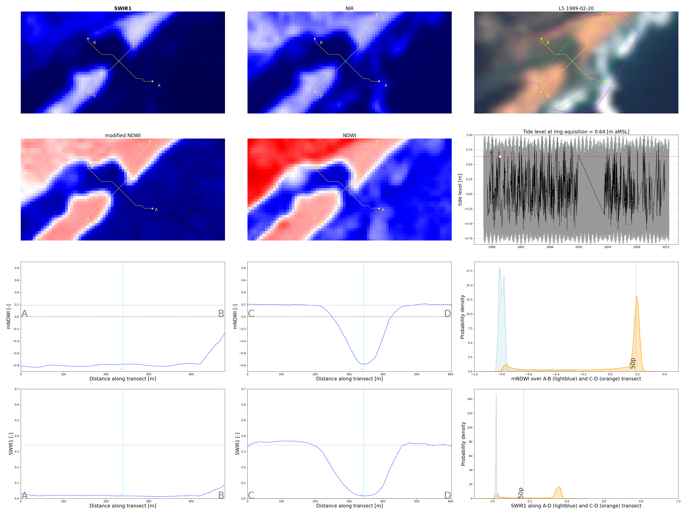

# EntranceSat

Valentin Heimhuber, University of New South Wales, Water Research Laboratory, 02/2021

## **Description**

EntranceSat is a Google Earth Engine enabled open source python software package that first uses a novel least cost path finding approach to trace IOCE entrance channels along and across the berm, and then analyses the resulting transects to infer whether an entrance is open or closed. EntranceSat is built on the satellite imagery download and pre-processing functionality of the CoastSat toolbox.

The underlying approach of the EntranceSat toolkit and it's performance is described in detail in the following publication:

Valentin Heimhuber, Kilian Vos, Wanru Fu, William Glamore (submitted): EntranceSat: A Google Earth Engine enabled open-source python tool for historic and near real-time monitoring of intermittent estuary entrances

Output files of EntranceSat include:
- Time series of along-berm and across-berm paths as .shp file for use in GIS software (no tidal correction)
- NIR, SWIR1, NDWI and mNDWI extracted along each along-berm and across-berm path
- For each processed image, the tool will output a 'dashboard' showing the location of the along-berm and across-berm paths along with the user-defined spectral transects and the level of the tide
- A variety of timeseries plots that illustrate the results of the algorithm

## **Installation**

The EntranceSat toolkit is run in the original CoastSat python environment, which uses the Google Earth Engine API to download and pre-process the satellite imagery. Please Refer to the CoastSat installation instructions 1.1. [https://github.com/kvos/CoastSat] for guidance on how to set up this environment correctly.

The basic steps to do this are: Download this repository -> Download the environment.yml file from the CoastSat repository and place it in the EntranceSat directory -> Download Anaconda -> create the EntranceSat environment via conda env create -f environment.yml -n EntranceSat -> 1.2 Activate Google Earth Engine Python API via CoastSat instructions -> you should be good to go.

Additional packages to manually install in the coastsat environment are:
- Rasterio [pip install rasterio]
- glob [conda install glob2]
- seaborn [conda install seaborn]
- fbriol fes [conda install -c fbriol fes]

ICOLLsat uses a global tide model reanalysis dataset provided through the pyfes package and this cannot just simply be installed through anaconda. FES2014 ranks as one of the best global tide models for coastal areas (based on an assessment on 56 coastal tide gauges, see this paper https://agupubs.onlinelibrary.wiley.com/doi/full/10.1002/2014RG000450.

	How to install fbriol fes (the global tide model (FES)) in a python environment:

	1. Download the source folder from here: https://bitbucket.org/fbriol/fes/downloads/ - unzip it and store in any prefered location.
	2. run: `conda install -c fbriol fes` #this works without step 1
	3. Test `import pyfes` in python
	4. Download **ocean tide**, **ocean_tide_extrapolated** and **load tide** .nc files from Aviso+ https://bitbucket.org/fbriol/fes/src/master/README.md. These are large netcdf files that contain all the outputs from the global tide model
	5. Save the .nc files in the source folder, under /data/fes2014 - when using fes in python, it will look for these files in the source folder, but the filepaths to each file have to be given manually (see code below)
	6. Update the .ini file to include the absolute path to each tidal component (.nc file)
	Done

## **Data Requirements**

All user input files (area of interest polygon, transects & tide data) are kept in the folder ".../Entrancesat/user_inputs"

- It is recommended that new analysis regions/ IOCEs are added directly to the input_locations.shp file via QGIS or ArcGIS. For each site, EntranceSat expects 6 polygons as shown in this example.

**Note:** The area of the polygon should not exceed 100 km2

## **Usage**

It is recommended the toolkit be run in spyder. Ensure spyder graphics backend is set to 'automatic' for proper plot rendering.
- Preferences - iPython console - Graphics - Graphics Backend - Automatic

EntranceSat is run from the EntranceSat_master.py file.
- Instructions and comments are provided in this file for each step.
- It is recommended steps be run as individual cells for first time users.

The key steps are briefly outlined here:

Interactive popup window steps include:
- Raw PlanetScope reference image selection for co-registration [step 1.2.]
- Top of Atmosphere merged reference image selection for shoreline extraction [step 2.1.]
- Reference shoreline digitisation (refer 'Reference shoreline' section of CoastSat readme for example) - [step 2.1.]
- Transect digitisation (optional - only if no transects.geojson file provided) - [step 2.1.]
- Manual error detection (optional - keep/discard popup window as per CoastSat) - [step 3.]
